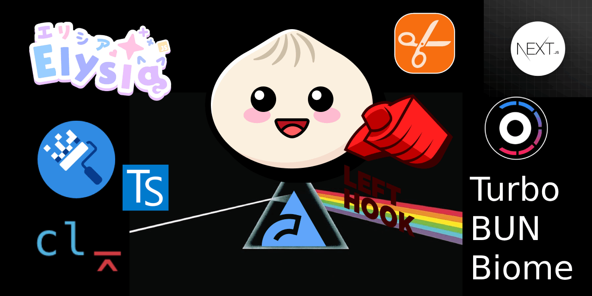

<!-- markdownlint-disable MD041 -->
<a id="readme-top"></a>

[![Contributors][contributors-shield]][contributors-url]
[![Forks][forks-shield]][forks-url]
[![Stargazers][stars-shield]][stars-url]
[![Issues][issues-shield]][issues-url]
[![MIT License][license-shield]][license-url]

<!-- PROJECT Banner -->
<div align="center" width="100%">
    
</div>

Basic template for Modern **Full Stack Web Developers**.
Powered with several **Linting Tools** and **Commit Hooks**, it will help you code *faster* and *better*.

<!-- TABLE OF CONTENTS -->
<details>
  <summary>Table of Contents</summary>

- [Features](#features)
  - [Monorepo features](#monorepo-features)
  - [Commit Conventions and Git Hooks](#commit-conventions-and-git-hooks)
  - [Linters](#linters)
- [Demo apps](#demo-apps)
- [Getting started](#getting-started)
  - [Monorepo Internal Packages](#monorepo-internal-packages)
  - [Bun Actions](#bun-actions)
  - [Available Bun Actions](#available-bun-actions)
  - [Generators](#generators)
- [Workflow](#workflow)
  - [Commit, Conventions and Hooks](#commit-conventions-and-hooks)
  - [GitHub Actions](#github-actions)
  - [Changesets](#changesets)
  - [Versioning](#versioning)
  - [Publishing to npm](#publishing-to-npm)
  - [GitHub Package Registry](#github-package-registry)
- [Contributing to TurboBun](#contributing-to-turbobun)
- [Inspired By](#inspired-by)
- [License](#license)

</details>

## Features

See [ROADMAP][ROADMAP]

### Monorepo features

- [Bun][Bun] - **node** and **vite** alternative
- [Turborepo][Turborepo] - for *faster builds*
- [Plop][Plop] - for *code generation*
- [degit][degit] - project scaffolding

### Commit Conventions and Git Hooks

- [Lefthook][Lefthook] for **GitHub Hooks**:
- [commitlint][commitlint] - Lint commit messages
- [commitizen][commitizen] - commit conventions
- [cz-git][cz-git] - commitizen adapter with emoji

### Linters

- [Biome][Biome] - **ESLint** and **prettier** alternative
- [TypeScript][TypeScript] for static type checking as **internal package**
- [Renovate][Renovate]- Dependency updater
- [case-police][case-police] - 🚨 Make the case correct, PLEASE!
- [knip][knip]- Cut the clutter from TypeScript projects
- [MarkdownLint][MarkdownLint] for linting markdown, see [MarkdownLint rules][MarkdownLint-rules] (as VS Code suggested plugin)
- [npm-check-updates][updates] for update packages (bun has issues with `bun outdated`)
- [CSVode Settings][vscode-settings] - workspace settings
- [CSVode Extensions][vscode-extensions] - suggested extensions

<p align="right">(<a href="#readme-top">back to top</a>)</p>

## Demo apps

- [Elysia][Elysia] - backend
- [Next.js][Next.js] - frontend

<p align="right">(<a href="#readme-top">back to top</a>)</p>

## Getting started

```sh
bunx degit mugencraft/turbobun my-app
cd my-app
bun install
```

To run:

```sh
bun dev
```

<p align="right">(<a href="#readme-top">back to top</a>)</p>

### Monorepo Internal Packages

To reference packages use the `workspace:*` key (see [workspaces][bun-workspaces]) :

```json
{
  "name": "pkg-a",
  "dependencies": {
    "pkg-b": "workspace:*"
  }
}
```

<p align="right">(<a href="#readme-top">back to top</a>)</p>

### Bun Actions

Using [--filter][bun-filter], you can run the dev script in all packages in parallel:

- `bun --filter '*' dev`
- `bun --filter './apps/**' dev`
- `bun --filter './packages/**'`
- `bun --filter './packages/foo'`

**Bun CLI Docs**:

- [bunx][bunx]
- [bun run][bun-run]
- [bun install][bun-install]
  - [bun add][bun-add]
  - [bun remove][bun-remove]
  - [bun update][bun-update]
  - [bun update][bun-update]

<p align="right">(<a href="#readme-top">back to top</a>)</p>

### Available Bun Actions

```sh
# Show Available actions
bun run
```

<p align="right">(<a href="#readme-top">back to top</a>)</p>

### Generators

Learn more about Turborepo Generators at [turbo: code-generation][turbo-generation]

**Generate New app or package**:

```sh
turbo gen workspace
```

**Generate Code**:

Turborepo uses a simplified [Plop][Plop]
configuration.

**Known issue**: ESM dependencies are not currently supported within custom generators.

For examples check also [turbo-codemod generators][turbo-codemod]

<p align="right">(<a href="#readme-top">back to top</a>)</p>

## Workflow

### Commit, Conventions and Hooks

You are free to install the **Git Hooks** to enforce standards, it's not mandatory.
Some coders don't like it and a wrong configuring will slow you down.

You can run checkers and linters.

If a check fails your commit fails.

If a linter change something automatically you can have unwanted behaviors.

In our example we run the checks without fixing stuff. Only **sort-package-json** will fix the order issues.

To install, run:

```sh
lefthook install
```

To enforce hooks installation add this to `packages.json`:

```json
{
  "scripts": {
    "postinstall": "lefthook install"
  }
}
```

<p align="right">(<a href="#readme-top">back to top</a>)</p>

### GitHub Actions

`CHANGELOG`, *versioning* and *publishing* is managed by **Changesets**

CI/CD and deploy will be managed by **Vercel**.

There is no need for **GitHub Actions**

### Changesets

To record a change, run:

```sh
bun changeset
```

Follow the prompts to describe the changes. Changesets will create a markdown
file in the `.changeset` directory detailing the changes.

<p align="right">(<a href="#readme-top">back to top</a>)</p>

### Versioning

When it's time to release, run:

```sh
bun changeset version
```

This command will bump the versions of the affected packages and update the
changelogs.

<p align="right">(<a href="#readme-top">back to top</a>)</p>

### Publishing to npm

To publish the packages to npm, run:

```sh
bun changeset publish
```

If you want to publish package to the public npm registry and make them publicly
available, this is already setup.

To publish packages to a private npm organization scope, **remove** the
following from each of the `package.json`'s

```diff
- "publishConfig": {
- "access": "public"
- },
```

<p align="right">(<a href="#readme-top">back to top</a>)</p>

### GitHub Package Registry

See [Working with the npm registry][github-registry]

<p align="right">(<a href="#readme-top">back to top</a>)</p>

## Contributing to TurboBun

Check [CONTRIBUTING][contributors-doc] for

<p align="right">(<a href="#readme-top">back to top</a>)</p>

## Inspired By

- [u1aryz/bun-biome-template][bun-biome-template]
- [codiplace/bun-monorepo][bun-monorepo]
- [othneildrew/Best-README-Template][Best-README]

<p align="right">(<a href="#readme-top">back to top</a>)</p>

## License

[MIT License](license-url)

<p align="right">(<a href="#readme-top">back to top</a>)</p>

<!-- MARKDOWN LINKS & IMAGES -->
<!-- https://www.markdownguide.org/basic-syntax/#reference-style-links -->
[contributors-shield]: https://img.shields.io/github/contributors/mugencraft/turbobun.svg?style=for-the-badge
[contributors-url]: https://github.com/mugencraft/turbobun/graphs/contributors
[contributors-doc]: ./docs/CONTRIBUTING.md
[forks-shield]: https://img.shields.io/github/forks/mugencraft/turbobun.svg?style=for-the-badge
[forks-url]: https://github.com/mugencraft/turbobun/network/members
[stars-shield]: https://img.shields.io/github/stars/mugencraft/turbobun.svg?style=for-the-badge
[stars-url]: https://github.com/mugencraft/turbobun/stargazers
[issues-shield]: https://img.shields.io/github/issues/mugencraft/turbobun.svg?style=for-the-badge
[issues-url]: https://github.com/mugencraft/turbobun/issues
[license-shield]: https://img.shields.io/github/license/mugencraft/turbobun.svg?style=for-the-badge
[license-url]: ./LICENSE
[ROADMAP]: ./ROADMAP.md

[Bun]: https://bun.sh/
[bun-workspaces]: https://bun.sh/docs/install/workspaces
[bun-filter]: https://bun.sh/docs/cli/filter
[bunx]: https://bun.sh/docs/cli/bunx
[bun-run]: https://bun.sh/docs/cli/run
[bun-install]: https://bun.sh/docs/cli/install
[bun-add]: https://bun.sh/docs/cli/add
[bun-remove]: https://bun.sh/docs/cli/remove
[bun-update]: https://bun.sh/docs/cli/update

[Turborepo]: https://turbo.build/
[turbo-generation]: https://turbo.build/repo/docs/guides/generating-code
[turbo-codemod]: https://github.com/vercel/turborepo/blob/main/packages/turbo-codemod/turbo/generators/config.ts
[Plop]: https://plopjs.com/documentation/

[TypeScript]: https://www.typescriptlang.org/
[Renovate]: https://github.com/renovatebot/renovate
[degit]: https://github.com/Rich-Harris/degit

[Lefthook]: https://github.com/evilmartians/lefthook
[commitlint]: https://commitlint.js.org/
[commitizen]: https://commitizen.github.io/cz-cli/
[cz-git]: https://github.com/Zhengqbbb/cz-git

[vscode-settings]: https://code.visualstudio.com/docs/getstarted/settings#_settings-json-file
[vscode-extensions]: https://code.visualstudio.com/docs/editor/extension-marketplace#_workspace-recommended-extensions
[Biome]: https://biomejs.dev/
[case-police]: https://github.com/antfu/case-police
[knip]: https://knip.dev/
[MarkdownLint]: https://github.com/DavidAnson/markdownlint
[MarkdownLint-rules]: https://github.com/DavidAnson/markdownlint/blob/main/schema/.markdownlint.jsonc
[updates]: https://github.com/raineorshine/npm-check-updates

[Elysia]: https://elysiajs.com/
[Next.js]: https://nextjs.org/

[github-registry]: https://docs.github.com/en/packages/working-with-a-github-packages-registry/working-with-the-npm-registry#publishing-a-package-using-publishconfig-in-the-packagejson-file

[bun-biome-template]: https://github.com/u1aryz/bun-biome-template
[bun-monorepo]: https://github.com/codiplace/bun-monorepo
[Best-README]: https://github.com/othneildrew/Best-README-Template
